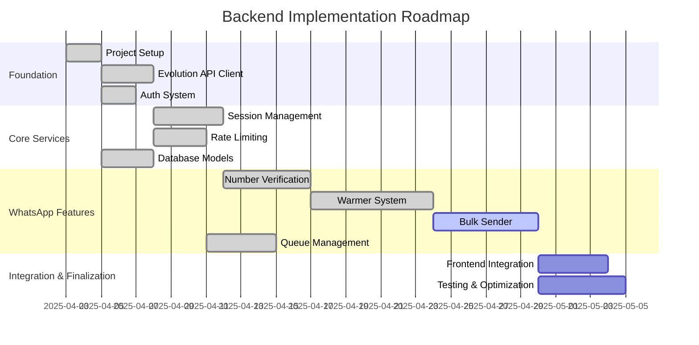

# Active Development Context

## Current Focus

## Recent Changes
1. Implemented full backend architecture with Express
2. Created comprehensive database models with Sequelize:
   - User management
   - Session handling
   - Verification campaigns and phone numbers
   - Warming configuration and scheduling
   - Bulk campaign management
3. Established Evolution API integration with client wrapper
4. Implemented authentication system with JWT
5. Built rate limiting with Redis-based semaphore system
6. Developed task queue for concurrent operation management
7. Implemented core controllers and routes:
   - Authentication
   - Session management
   - Number verification
   - Account warming

## Next Steps
1. Complete bulk messaging controller and routes
2. Implement analytics endpoint for campaign performance
3. Develop monitoring system for operation health
4. Connect frontend to backend API endpoints
5. Implement message template personalization
6. Add comprehensive error handling and recovery
7. Perform thorough testing and optimization
8. Document API endpoints for frontend consumption

## Key Technical Decisions
1. Using semaphore patterns with Redis for operation rate limiting
2. Implementing JWT-based authentication with role-based access
3. Using background processes for verification and warming tasks
4. Caching verification results to minimize redundant API calls
5. Structuring models to support efficient querying and relationships
6. Implementing proper error handling with standardized responses
