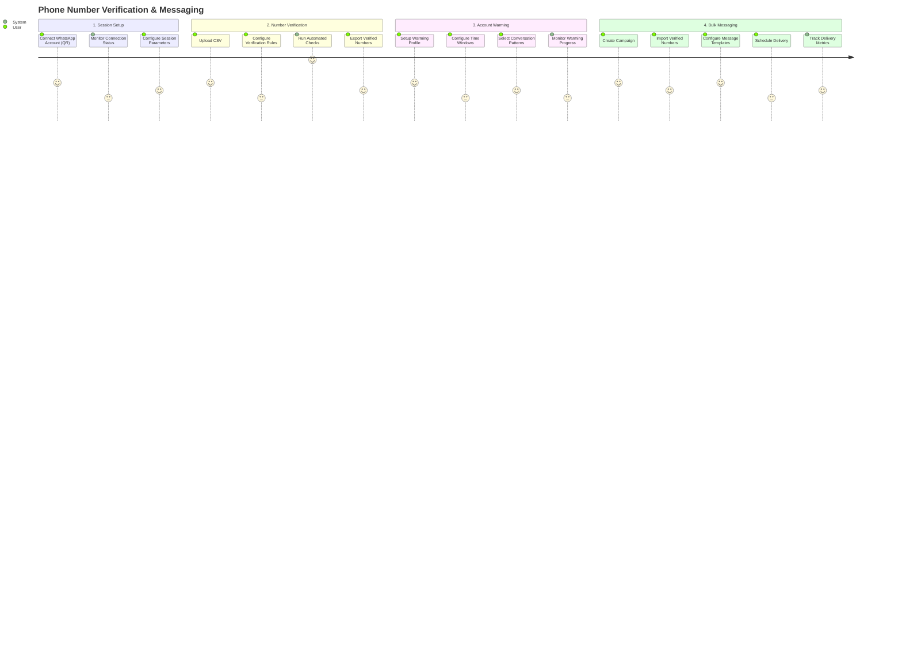

# Product Context

## Problem Space
- Manual phone number verification processes are time-consuming and error-prone
- Lack of centralized management for WhatsApp campaigns and sessions
- Difficulty maintaining optimal sender reputation to avoid blocking
- Risk of WhatsApp account bans due to improper messaging patterns
- Complex rate limiting requirements for WhatsApp operations

## User Goals

1. **Marketing Teams**:
   - Execute bulk verification campaigns to identify valid WhatsApp numbers
   - Monitor sender reputation metrics across multiple accounts
   - Schedule automated warming sequences with natural conversation patterns
   - Send personalized bulk messages to verified numbers
   - Track campaign performance with detailed analytics

2. **Operations Teams**:
   - Manage multiple WhatsApp device sessions at scale
   - Configure complex warming rules based on best practices
   - Implement session rotation strategies to distribute load
   - Audit verification results and export for other systems
   - Maintain healthy session connections with automatic recovery

3. **Administrators**:
   - Monitor system performance and operation rates
   - Configure global rate limiting parameters
   - Manage user access and permissions
   - Audit system activity and operation logs

## Evolution API Integration Benefits

1. **Enhanced WhatsApp Connectivity**:
   - Direct integration with WhatsApp without browser automation
   - Multiple session management from a single interface
   - Stable connection with automatic recovery mechanisms
   - Support for all WhatsApp message types and features

2. **Advanced Rate Limiting**:
   - Configurable delays between operations to avoid detection
   - Intelligent session rotation to distribute workload
   - Automatic pausing when failure rates exceed thresholds
   - Periodic longer pauses to mimic natural usage patterns

3. **Operational Efficiency**:
   - Concurrent operation handling (up to 25 simultaneous tasks)
   - Cache layer to minimize redundant API calls
   - Intelligent failure recovery with automatic retries
   - Background job processing for resource-intensive tasks

## Key Differentiators

1. Integrated verification, warming, and messaging workflow in a single platform
2. AI-powered warming pattern optimization using OpenAI for natural conversations
3. Enterprise-grade rate limiting and anti-ban protection measures
4. Comprehensive campaign performance analytics and health monitoring
5. Multi-session management with intelligent load distribution

## Critical User Journeys

## Key Performance Indicators

1. **Verification Efficiency**:
   - Number verification success rate
   - Verification cost per number (API calls)
   - Verification speed (numbers per hour)
   - Session utilization balance

2. **Warming Effectiveness**:
   - Account blocking incident rate
   - Message delivery success rate
   - Warming pattern diversity
   - Session health after warming cycles

3. **Bulk Messaging Performance**:
   - Message delivery rate
   - Media delivery success
   - Campaign completion time
   - Error rates by message type

4. **System Performance**:
   - API response times
   - Background job processing rate
   - Cache hit ratios
   - Connection stability metrics
