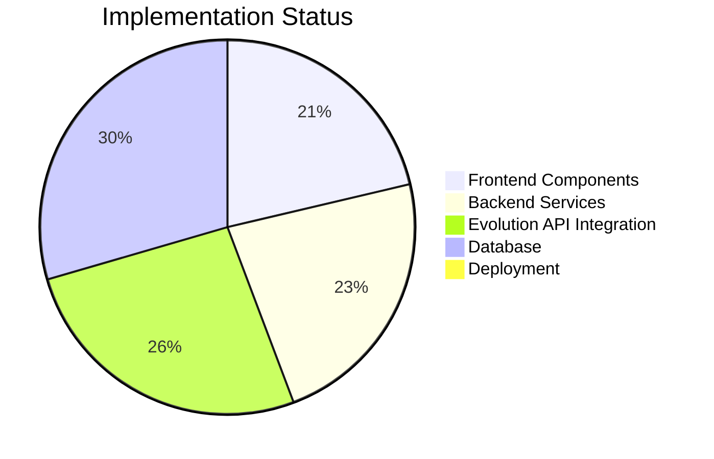
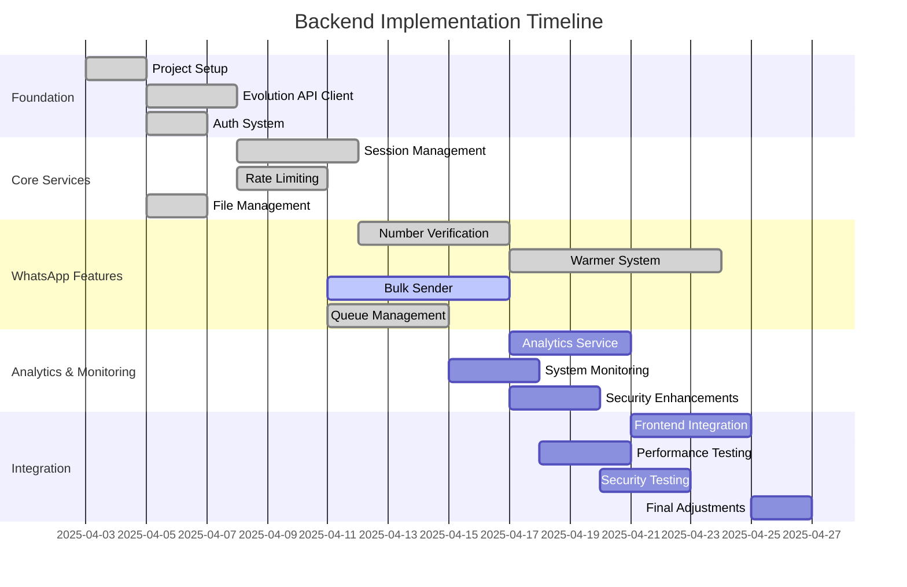

# Development Progress

## Component Status

## Implementation Roadmap

## Key Completed Features

### Frontend
1. Verification Wizard UI
2. Campaign Table Structure
3. Basic Warming Configuration
4. Session Monitoring Dashboard
5. Protected Routing System

### Backend (Recently Completed)
1. **Foundation Layer**
   - Node.js/Express project structure ✅
   - PostgreSQL database connection with Sequelize ✅
   - Redis configuration for caching and queues ✅
   - Evolution API client wrapper with rate limiting ✅
   - Authentication system with JWT ✅

2. **Core Services**
   - User model and authentication controller ✅
   - Session management system ✅
   - Rate limiting & semaphore-based throttling ✅
   - Task queue & concurrency control ✅
   - File management utilities ✅

3. **WhatsApp Integration**
   - Number verification service with batch processing ✅
   - Warmer implementation with scheduling ✅
   - Bulk sender service (in progress) 🔄
   - Advanced queue management ✅

4. **Models & Database Structure**
   - User model with authentication ✅
   - Session model with status tracking ✅
   - VerificationCampaign and PhoneNumber models ✅
   - Warmer model with scheduling capabilities ✅
   - BulkCampaign model with recipient management ✅

## Pending Implementation

1. **WhatsApp Features (1 week)**
   - Complete bulk sender controller
   - Message template personalization
   - Advanced media handling

2. **Analytics & Monitoring (1-2 weeks)**
   - Analytics data collection
   - System monitoring and health checks
   - Performance metrics gathering
   - Admin dashboards

3. **Integration & Testing (2 weeks)**
   - Frontend integration
   - End-to-end testing
   - Performance optimization
   - Security hardening

## Critical Technical Challenges Addressed

1. **Rate Limiting** ✅
   - Implemented configurable delays (40-200s bulk, 30-90s warming)
   - Added periodic pauses (every 10 messages)
   - Created session rotation strategy with Redis tracking

2. **Concurrency Management** ✅
   - Built semaphore-based task limiting (max 25 concurrent)
   - Implemented queue management for high load periods
   - Added failure rate monitoring with auto-pausing

3. **Session Health** ✅
   - Established connection status monitoring
   - Added automatic reconnection logic
   - Implemented session usage limits with Redis counters

4. **Data Processing** ✅
   - Created phone number formatting & validation utilities
   - Implemented CSV processing with error handling
   - Added OpenAI conversation generation simulation

## Remaining Challenges

1. **Performance Optimization**
   - Stress testing under load conditions
   - Query optimization for large datasets
   - Reducing API latency on critical paths

2. **Security Enhancements**
   - Adding comprehensive input validation
   - Implementing rate limiting for API endpoints
   - Adding audit logging for sensitive operations

3. **Scaling Considerations**
   - Database connection pooling optimization
   - Redis cluster configuration
   - Horizontal scaling preparations
