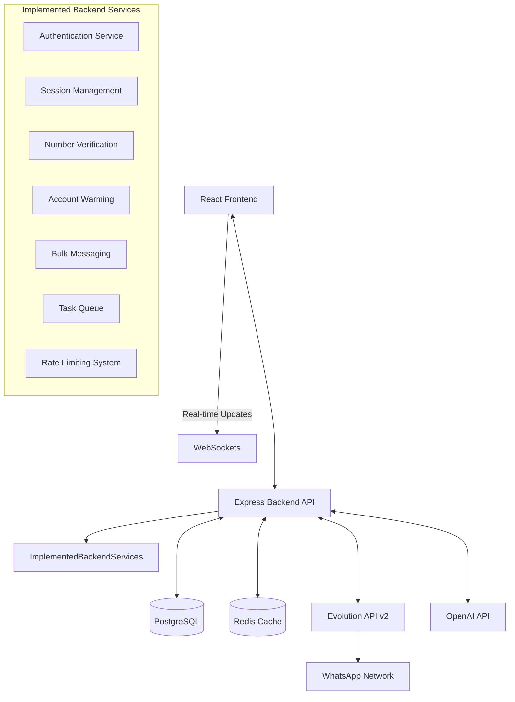
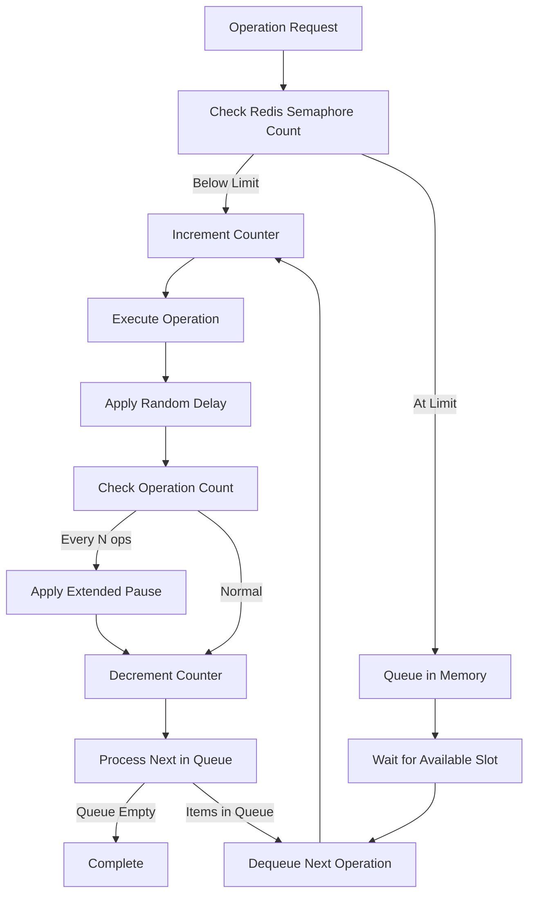
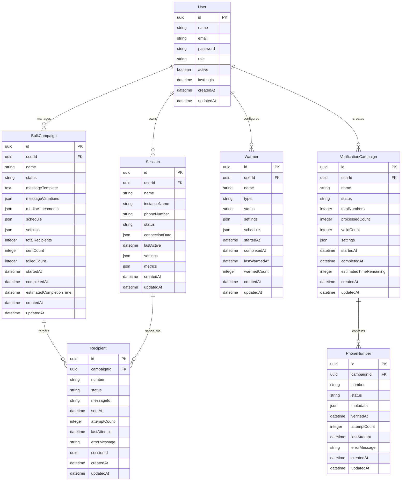
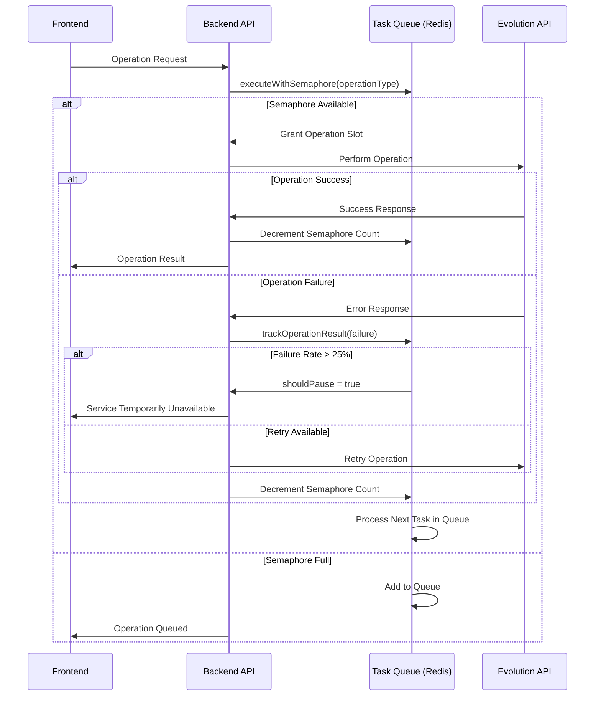

# System Architecture Patterns

## Core Architecture


## Implemented Data Flows

1. **Session Management Flow**:
   ```mermaid
   sequenceDiagram
       participant Client as Frontend
       participant API as Express API
       participant EvAPI as Evolution API

       Client->>API: Create Session Request
       API->>EvAPI: Initialize Session
       EvAPI->>API: Return QR Code
       API->>Client: Send QR Code for Scanning

       Note over Client: User Scans QR Code

       API->>EvAPI: Check Connection Status
       EvAPI->>API: Session Connected
       API->>Client: Session Active Confirmation

       loop Status Monitoring
           API->>EvAPI: Get Session Status
           EvAPI->>API: Return Status
           API->>Client: Update Status UI
       end
   ```

2. **Number Verification Pipeline**:
   ```mermaid
   sequenceDiagram
       participant Client as Frontend
       participant API as Express API
       participant Queue as Task Queue
       participant Cache as Redis Cache
       participant EvAPI as Evolution API

       Client->>API: Upload Numbers CSV
       API->>API: Format & Deduplicate
       API->>API: Create Verification Campaign

       Client->>API: Start Campaign

       loop Batch Processing
           API->>Queue: Process Batch with Semaphore
           Queue->>API: Approve Process Start

           loop For Each Number
               API->>Cache: Check if Result Cached

               alt Cache Hit
                   Cache->>API: Return Cached Result
               else Cache Miss
                   API->>EvAPI: Check Number Exists
                   EvAPI->>API: Return Status
                   API->>Cache: Store Result (24h TTL)
               end

               API->>API: Update Database Records
               API->>API: Apply Random Delay
           end

           API->>Queue: Release Semaphore
           API->>Client: Update Progress
       end

       API->>Client: Campaign Complete
   ```

3. **Warming Sequence**:
   ```mermaid
   sequenceDiagram
       participant Client as Frontend
       participant API as Express API
       participant Queue as Task Queue
       participant GenAI as OpenAI API
       participant EvAPI as Evolution API

       Client->>API: Create Warming Configuration

       alt AI Enabled
           API->>GenAI: Generate Conversation Patterns
           GenAI->>API: Return Conversation Data
           API->>API: Process & Store Conversations
       end

       Client->>API: Activate Warmer

       loop Scheduled Periods
           API->>API: Check If Schedule Active

           loop For Each Message
               API->>Queue: Request Semaphore
               Queue->>API: Grant Permission

               API->>API: Calculate Random Delay
               Note over API: Apply Delay (30-90s)

               API->>EvAPI: Send Warming Message
               EvAPI->>API: Confirm Sent

               API->>Queue: Release Semaphore
               API->>API: Update Warming Progress
           end
       end

       API->>Client: Warming Complete
   ```

4. **Bulk Messaging Flow** (In Progress):
   ```mermaid
   sequenceDiagram
       participant Client as Frontend
       participant API as Express API
       participant Queue as Task Queue
       participant Cache as Redis Cache
       participant EvAPI as Evolution API

       Client->>API: Create Campaign & Upload Recipients
       Client->>API: Configure Message Template
       Client->>API: Start Campaign

       API->>Queue: Process With Rate Limiting

       loop For Each Recipient Batch
           API->>Queue: Acquire Semaphore
           Queue->>API: Grant Permission

           loop For Each Message (with session rotation)
               API->>API: Apply Random Delay (40-200s)
               API->>API: Select Session (Round-Robin)
               API->>EvAPI: Send Message
               EvAPI->>API: Delivery Status

               API->>API: Update Send Statistics

               alt Every 10 Messages
                   Note over API: Apply 120s Pause
               end
           end

           API->>Queue: Release Semaphore
           API->>Client: Update Progress
       end

       API->>Client: Campaign Complete
   ```

## Rate Limiting Implementation


## Implemented Database Schema


## Critical Task Processing Pattern


## API Endpoint Structure
```mermaid
flowchart TD
    API[API Routes] --> Auth[/auth]
    API --> Sessions[/sessions]
    API --> Verifier[/verifier]
    API --> Warmers[/warmers]
    API --> BulkSender[/bulk]
    API --> Analytics[/analytics]

    Auth --> Register[POST /register]
    Auth --> Login[POST /login]
    Auth --> Me[GET /me]

    Sessions --> GetAll[GET /]
    Sessions --> Create[POST /]
    Sessions --> GetOne[GET /:id]
    Sessions --> Delete[DELETE /:id]
    Sessions --> Status[GET /:id/status]
    Sessions --> QR[GET /:id/qr]
    Sessions --> Restart[POST /:id/restart]

    Verifier --> Campaigns[GET /]
    Verifier --> NewCampaign[POST /]
    Verifier --> GetCampaign[GET /:id]
    Verifier --> Start[POST /:id/start]
    Verifier --> Pause[POST /:id/pause]
    Verifier --> Numbers[GET /:id/numbers]
    Verifier --> Export[GET /:id/export]

    Warmers --> AllWarmers[GET /]
    Warmers --> NewWarmer[POST /]
    Warmers --> GetWarmer[GET /:id]
    Warmers --> Status[PUT /:id/status]
    Warmers --> Restart[POST /:id/restart]
    Warmers --> Delete[DELETE /:id]

    BulkSender --> Campaigns[GET /]
    BulkSender --> Create[POST /]
    BulkSender --> Get[GET /:id]
    BulkSender --> Start[POST /:id/start]
    BulkSender --> Pause[POST /:id/pause]
    BulkSender --> Recipients[GET /:id/recipients]
    BulkSender --> Stats[GET /:id/stats]
