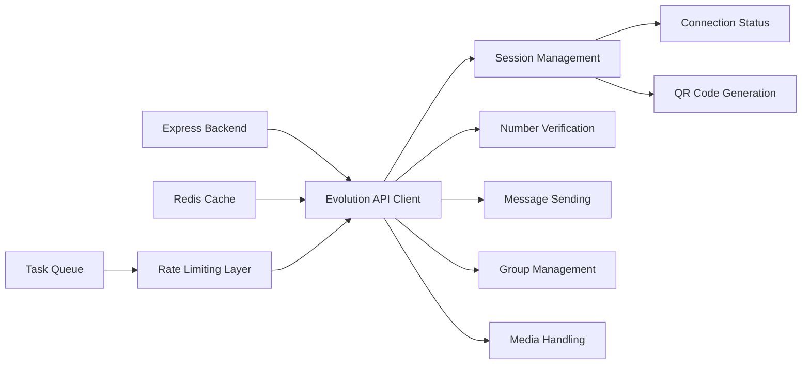
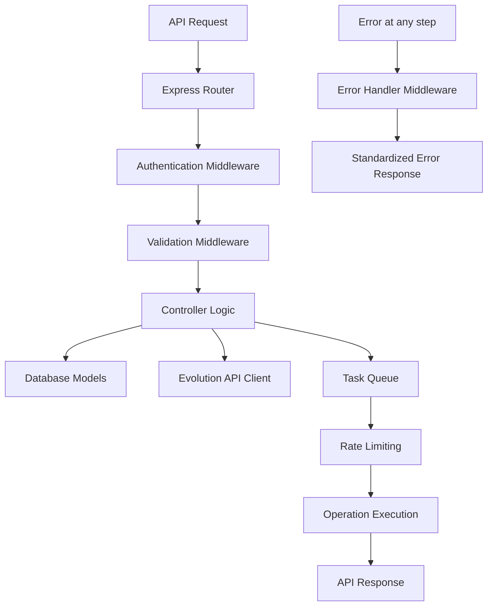

# Technical Context

## Core Stack
- **Frontend**:
  - React 18 + TypeScript
  - Vite Build System
  - Shadcn/ui Component Library
  - Tailwind CSS v3.3
  - React Router v6
- **Backend**:
  - Node.js Express
  - PostgreSQL Database with Sequelize ORM
  - Redis for caching, queue management, and semaphores
  - Evolution API v2 integration
  - OpenAI API for conversation generation
- **State Management**:
  - Context API
  - Zustand for shared state
- **API Integration**:
  - Axios for HTTP client
  - WebSocket for real-time updates
- **Build Tools**:
  - ESLint + Prettier
  - PostCSS
  - TypeScript 5.0

## Key Dependencies

```mermaid
flowchart TD
    Frontend[Frontend Stack] --> React
    Frontend --> ReactDOM
    Frontend --> Vite
    Frontend --> TailwindCSS

    Backend[Backend Stack] --> Express
    Backend --> PostgreSQL[PostgreSQL + Sequelize]
    Backend --> Redis
    Backend --> Evolution[Evolution API v2]
    Backend --> OpenAI

    State[State Management] --> Zustand
    State --> ContextAPI

    Integration[API Integration] --> Axios
    Integration --> WebSockets

    Forms[Forms & Inputs] --> ReactHookForm
    Forms --> Zod

    Tables[Data Display] --> TanstackTable

    Visualization[Analytics] --> Recharts
```


## Implemented Evolution API v2 Integration


## Backend Database Implementation
PostgreSQL database with Sequelize ORM and the following key tables implemented:
- **Users**: Authentication and user management
- **Sessions**: WhatsApp session management
- **VerificationCampaigns**: Number verification campaigns
- **PhoneNumbers**: Verified phone number data
- **Warmers**: Account warming configurations
- **BulkCampaigns**: Bulk messaging campaigns
- **Recipients**: Message recipient management

## Rate Limiting Configuration
- **Bulk Messaging**: 40-200 seconds between messages, pause 120s every 10 messages
- **Verification**: Maximum 2500 numbers per session in 12 hours, batch size of 50
- **Warming**: 30-90 seconds between messages
- **Concurrency**: Maximum 25 simultaneous operations using semaphore pattern

## Technical Design Decisions
1. **Semaphore Pattern**: Using Redis for distributed rate limiting and concurrency control
2. **Sequelize ORM**: Using for database interaction with consistent model definitions
3. **JWT Authentication**: Implementing token-based authentication with role checks
4. **Background Processing**: Using asynchronous processing for long-running tasks
5. **Centralized Error Handling**: Standardized error responses and handling middleware

## Critical Technical Constraints
1. **WhatsApp API Limits**: Carefully managed operation frequency with rate limiting
2. **Concurrent Operations**: Limited to 25 simultaneous operations
3. **Session Management**: Tracking session health and reconnecting as needed
4. **Media Files**: Maximum 50MB size limit for media uploads

## Development Environment
- Node.js v18+
- PostgreSQL 14+
- Redis 6+
- Bun package manager
- VS Code with TypeScript plugin
- Chrome DevTools
- Postman for API testing

## Critical Backend Paths
1. **Configuration**:
   - Config Settings: `src/config/config.js`
   - Database Connection: `src/config/database.js`
   - Redis Setup: `src/config/redis.js`

2. **Middleware**:
   - Authentication: `src/middleware/authenticate.js`
   - Error Handling: `src/middleware/errorHandler.js`
   - Validation: `src/middleware/validate.js`

3. **Models**:
   - Database Models: `src/models/`
   - User Model: `src/models/User.js`
   - Session Model: `src/models/Session.js`
   - VerificationCampaign: `src/models/VerificationCampaign.js`
   - PhoneNumber: `src/models/PhoneNumber.js`
   - Warmer: `src/models/Warmer.js`
   - BulkCampaign: `src/models/BulkCampaign.js`

4. **Core Services**:
   - Evolution API Client: `src/lib/evolutionApiClient.js`
   - Task Queue: `src/lib/taskQueue.js`
   - Logging: `src/utils/logger.js`

5. **Controllers & Routes**:
   - Auth Controller: `src/controllers/auth.controller.js`
   - Session Controller: `src/controllers/session.controller.js`
   - Verifier Controller: `src/controllers/verifier.controller.js`
   - Warmer Controller: `src/controllers/warmer.controller.js`
   - Auth Routes: `src/routes/auth.routes.js`
   - Session Routes: `src/routes/session.routes.js`
   - Verifier Routes: `src/routes/verifier.routes.js`
   - Warmer Routes: `src/routes/warmer.routes.js`

## API Request Flow


## Error Handling Strategy
```mermaid
flowchart TD
    Error[Error Occurs] --> Operational{Operational Error?}

    Operational -->|Yes| Log[Log Error Details]
    Operational -->|No| CriticalLog[Log Critical Error]

    Log --> ClientResponse[Format Client Response]
    CriticalLog --> Recovery[Attempt Recovery]
    Recovery --> ClientResponse

    ClientResponse --> Status[Set HTTP Status]
    Status --> Format[Format JSON Response]
    Format --> Send[Send to Client]
